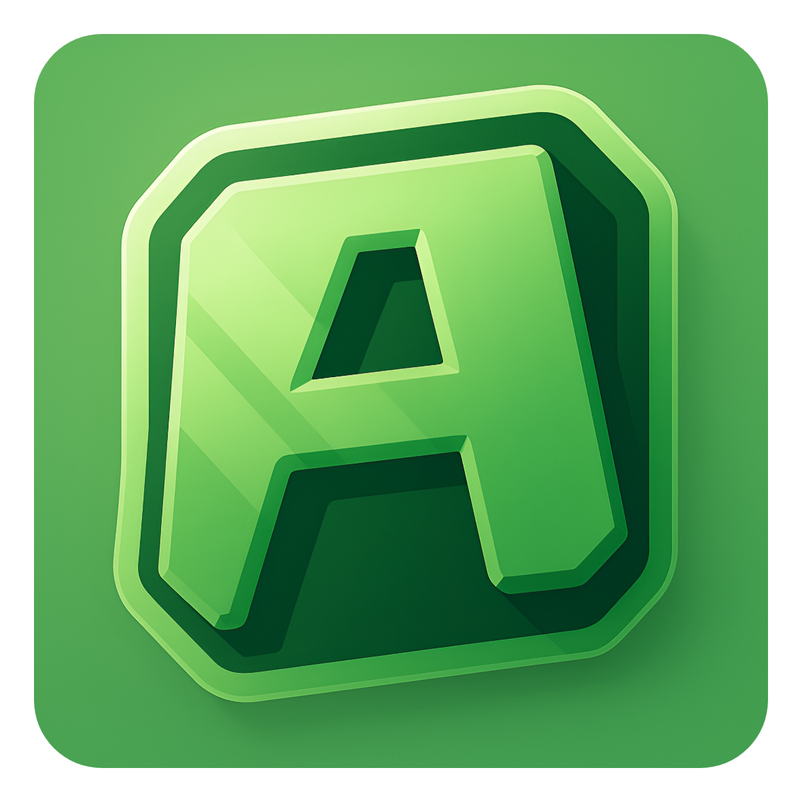

<h1 align="center">AS Launcher</h1>

[
]()

[
]()

---
### **<ins>
Condiciones de uso:
**
- Para utilizar el código debes hacer un fork del proyecto.
- Para utilizar el código, tu código debe ser siempre público.
- Para utilizar el código, se debe conservar toda mención original de la licencia.
- Para utilizar el código debes conservar la licencia original.
---

### **<ins>
Características del launcher:
**

- ✅ Actualizaciones automáticas vía GitHub.

- 🔴 Opción para poner el launcher en mantenimiento.

- 🔒 Autenticación de Microsoft.

- 🔒 Pronto conexion con cuentas OFFLINE.

- ⛏️ Soporta todas las versiones de Minecraft 1.0 > más recientes.

- 📦 Soporta versiones modificadas con Forge, NeoForge, LegacyFabric, FabricMC y Quilt.

- 📰 Sección de noticias integrada nativamente en el launcher.

- ⚙️ Gestión intuitiva de los ajustes, incluyendo un panel de configuración de Java.

- 🟢 Estado completo del servidor.

    - Operativo o fuera de línea.
    
    - Número de jugadores conectados.

- ☕ Instalación automática de Java.

    - Si has instalado una versión incompatible de Java, instalaremos la correcta para ti.
    
    - No necesitas tener Java instalado para ejecutar el launcher.

¡Esta no es una lista exhaustiva. Instala el launcher para ver todo lo que puede hacer!

¿Te gusta el proyecto? ¡Deja una estrella ⭐ en el repositorio!

---

### **<ins>
Descarga:
**

Puedes descargar el launcher desde las [Releases de GitHub](../../../releases).

Plataformas soportadas:

- Windows 
- Linux
- MacOS

Si descargas desde las Releases, selecciona el instalador para tu sistema.

 Plataforma | Archivo |
| -------- | ---- |
| Windows x64 | `Selvania-Launcher-win-x64.exe ` |
| macOS x64 | `Selvania-Launcher-mac-x64.dmg` |
| macOS arm64 | `Selvania-Launcher-mac-arm64.dmg` |
| Linux x64 | `Selvania-Launcher-linux-x86_64.AppImage` |

---

<h1 align="center">AS Launcher</h1>

[
]()

[
]()

---
### **<ins>
Conditions d'utilisation:
**
- Pour utiliser le code vous devez faire un fork du projet.
- Pour utiliser le code votre code doit tout le temps être public.
- Pour utiliser le code toute mention originale de la licence doit être gardé.
- Pour utiliser le code vous devez garder la licence originale.
---

### **<ins>
Fonctionnalitées du launcher :
**

- ✅ Mise à jour automatiques via github.

- 🔴 Option pour mettre le launcher en maintenance.

- 🔒 Authentification Microsoft.

- ⛏️ Supporte toutes versions de Minecraft 1.0 > latest.

- 📦 Supporte les version moddées Forge, NeoForge, LegacyFabric, FabricMC et Quilt

- 📰 Fil d'actualité intégré nativement au launcher.

- ⚙️ Gestion intuitive des paramètres, y compris un panneau de configuration Java.

- 🟢 Statut serveur complet.

    - Opérationnel ou hors ligne.
    
    - Nombres de joueurs connectés.

- ☕ Installation de Java automatique.

    - Si vous avez installé une version incompatible de Java, nous installerons la bonne pour vous.
    
    - Vous n'avez pas besoin d'avoir Java installé pour exécuter le launcher.

Ce n'est pas une liste exhaustive. Installez le launcher pour voir tout ce qu'il peut faire !

Vous aimez le projet ? Laissez une étoile ⭐ sur le repo !

---

### **<ins>
Téléchargement :
**

Vous pouvez télécharger le launcher à partir des [Releases GitHub](../../../releases).

Plateformes supportées :

- Windows 
- Linux
- MacOS

Si vous téléchargez à partir des Releases, sélectionnez le programme d'installation de votre système.

 Plateforme | Fichier |
| -------- | ---- |
| Windows x64 | `Selvania-Launcher-win-x64.exe ` |
| macOS x64 | `Selvania-Launcher-mac-x64.dmg` |
| macOS arm64 | `Selvania-Launcher-mac-arm64.dmg` |
| Linux x64 | `Selvania-Launcher-linux-x86_64.AppImage` |

---